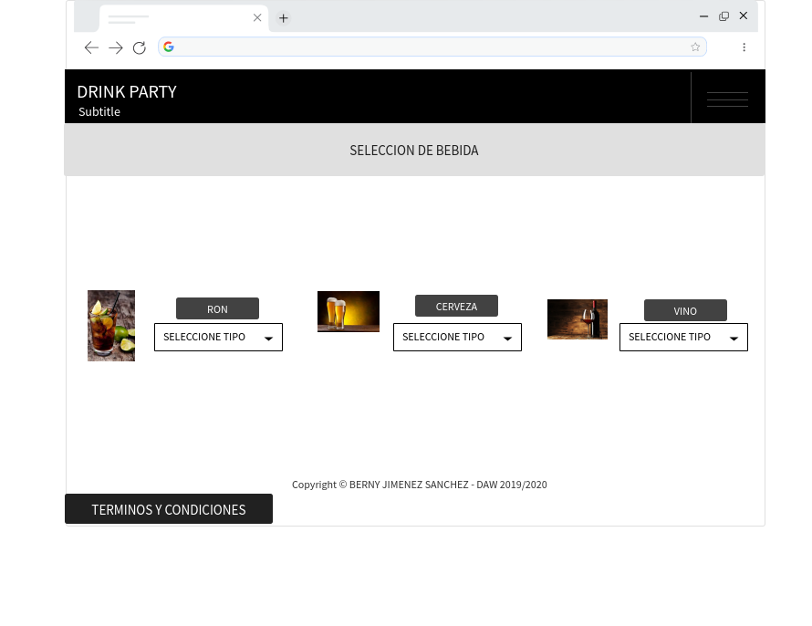
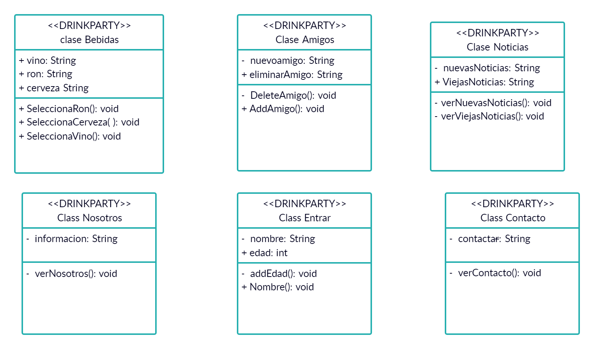
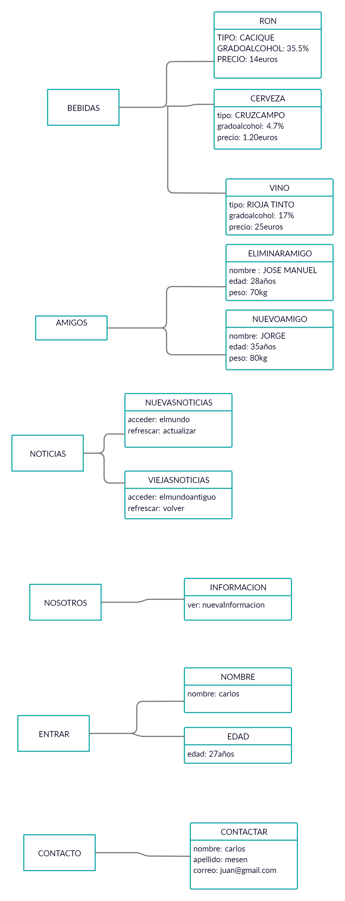

# Sprint2

### Se ha utilizado la herramienta

### Mockup

> Para el diseño de diagramas UML he utilizado la herramienta Creately

###  Marckdown

 > Para la herramienta Marckdown  se ha utilizado MarkPad y se han utilizado para su aprendizaje tutoriales de YouTube

### https://www.youtube.com/watch?v=y6XdzBNC0_0

### Mockup

* Descripción
> Este Mockup es el diseño de la selección de bebida el cual permite escoger 3 opciones diferentes

## Diagramas

> Se han creado seis clases diferentes entre las que se encuentran bebidas, amigos, noticias, nosotros, entrar y contacto entre estas clases cada una tendrá un método diferente asociado que le permitirá interactuar con diferentes usuarios para generar diferentes acciones siempre y cuando sea ya un usuario con acceso y sea mayor de edad

### Diagramas de Clases:

