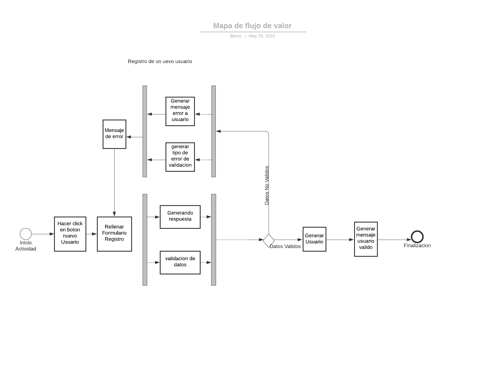
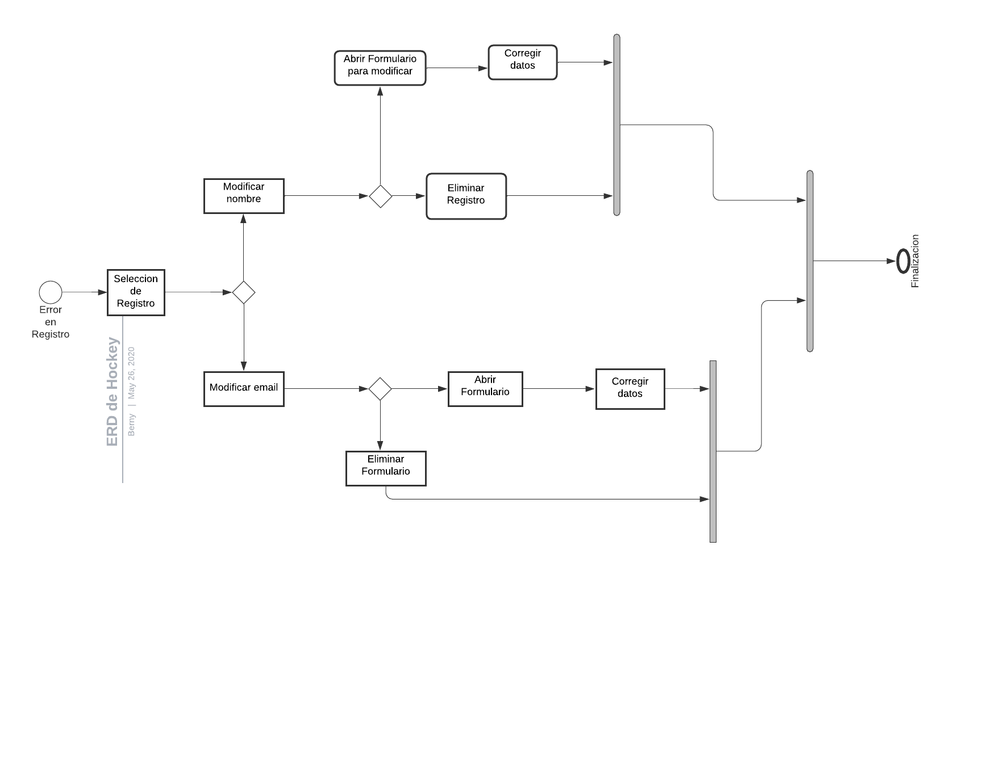

# Proyecto Aplicación Web

## Proyecto de diseño de una Aplicación Web para la asignatura Entorno de Desarrollo curso 2019-2020

> Nombre de la aplicación: Drink Party

> Nombre del alumno: **[Berny Jimenez](https://www.linkedin.com/in/berny-jiménez-7027a7177)**

> Especificaciones:
  * Sprint: 5
  * Fecha del Sprint: 21/05/2020
  * Tareas realizadas por el alumno:
  * Diagrama de actividades 1
  * Diagrama de actividades 2
 
> Tiempo empleado en cada tarea:
  * Diagrama de actividades 1:  25min
  * Diagrama de actividades 2:  25min
 
    
> Herramientas usadas:
 * LucidChart
 * Creately
 * Git
 * Github
 
> Bibliografía usada:

# Sprint 5

## Diagrama de actividades 1

## Diagrama de actividades 2

