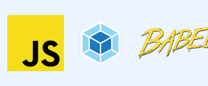

# Proyecto Aplicación Web

## Proyecto de diseño de una Aplicación Web para la asignatura Entorno de Desarrollo curso 2019-2020

> Nombre de la aplicación: Drink Party

> Nombre del alumno: **[Berny Jimenez](https://www.linkedin.com/in/berny-jiménez-7027a7177)**

> Especificaciones:
  * Sprint: 6
  * Fecha del Sprint: 23 mayo 2020
  * Tareas realizadas por el alumno:
  * Búsqueda de Información
  * Markdown 
  * Tabla con el contenido
> Tiempo empleado en cada tarea:
  * Búsqueda de Información: 60min
  * Markdown : 20min
  * Tabla con el contenido: 45min   
> Herramientas usadas:
  * LucidChart
  * Creately
  * Git
  * Github
 
> Bibliografía usada:

## Tabla

<table style="width: 100%; text-align: center;">
  <tr style="color: white; background: grey">
    <td style="width: 15%;">Partes</td>
    <td style="width: 20%;">Tecnología Escogida</td>
    <td style="width: 20%;">Logo</td>
    <td style="width: 34%;">¿Por qué esta tecnologia?</td>
  </tr>
  <tr>
    <td style="width: 15%;">Core</td>
    <td style="width: 20%;">NODEJS</td>
    <td style="width: 20%;"></td>
    <td style="width: 34%;">Al implementar dependencias de Bootstrap se utilizan diferentes tecnologias entre ellas NodeJS en mi caso al conocer poco pienso que es la que he visto mas utilizada en mi entorno por lo cual sera la que utilizare</td>
  </tr>  
  <tr>
    <td style="width: 15%;">Text Editor</td>
    <td style="width: 20%;">Eclipse</td>
    <td style="width: 20%;"></td>
    <td style="width: 34%;">He elegido este editor debido a la facilidad que genera al permitir dependencias e implementarlas directamente lo cual me ha ahorrado mucho tiempo</td>
  </tr>
  <tr>
    <td style="width: 15%;">UI Framework</td>
    <td style="width: 20%;">Bootstrap</td>
    <td style="width: 20%;"></td>
    <td style="width: 34%;">Bootstrap es un framework que ayuda al programador a diseñar, tanto asi que puede hacer una aplicacion responsive entre otras de sus utilidades</td>
  </tr>
  <tr>
    <td style="width: 15%;">Responsible web design</td>
    <td style="width: 20%;">Bootstrap</td>
    <td style="width: 20%;"></td>
    <td style="width: 34%;">Bootstrap es una herramiente que puede hacer respnsive la aplicacion adaptandose a cualquier sistema</td>
  </tr>
  <tr>
    <td style="width: 15%;">Templating</td>
    <td style="width: 20%;">JSX</td>
    <td style="width: 20%;"></td>
    <td style="width: 34%;">JSX es una extensión de JavaScript. Sirve de preprocesador (como Sass o Stylus a CSS) y transforma el código a JavaScript</td>
  </tr>
  <tr>
    <td style="width: 15%;">Browser Refreshing</td>
    <td style="width: 20%;">Live Server</td>
    <td style="width: 20%;"></td>
    <td style="width: 34%;">El live server es un servidor local en el que además podrás ver los cambios en cuanto los hagas. Así no tendremos que recargar el navegador una y otra vez</td>
  </tr>
  <tr>
    <td style="width: 15%;">CSS Preprocessor</td>
    <td style="width: 20%;">Sass</td>
    <td style="width: 20%;"></td>
    <td style="width: 34%;">Cualquier preprocesador es perfectamente válido. Podríamos sin duda elegir otras alternativas como Less o Stylus y estaría bien para nosotros y nuestro proyecto, ya que al final todos ofrecen más o menos las mismas utilidades. Pero sin embargo, Sass se ha convertido en el preprocesador más usado y el más demandado. a nivel comercial es mejor conocer como utilizarlo para nuestro futuro laboral</td>
  </tr>
  <tr>
    <td style="width: 15%;">OOCSS and Style Guide</td>
    <td style="width: 20%;">Pattern Lab</td>
    <td style="width: 20%;"></td>
    <td style="width: 34%;">En esencia, Pattern Lab es un generador de sitio estático alimentado por Node que une los componentes de la interfaz de usuario. por lo cual en mi caso me ha facilitado el trabajo</td>
  </tr>
  <tr>
    <td style="width: 15%;">Version Control</td>
    <td style="width: 20%;">Git</td>
    <td style="width: 20%;"></td>
    <td style="width: 34%;">Al ser la mas utilizada y a la vez una de las herramientas mas completas</td>
  </tr>
  <tr>
    <td style="width: 15%;">Package Manager</td>
    <td style="width: 20%;">npm</td>
    <td style="width: 20%;"></td>
    <td style="width: 34%;"> Es un gestor de paquetes, el cual nos brinda facilidad al momento de trabajar con Node.</td>
  </tr>
  <tr>
    <td style="width: 15%;">Front-End Performance</td>
    <td style="width: 20%;">WebPagetest</td>
    <td style="width: 20%;"></td>
    <td style="width: 34%;">ya que nos permite valorar y analizar el tiempo de carga y al ser gratuita</td>
  </tr>
  <tr>
    <td style="width: 15%;">JS Framework</td>
    <td style="width: 20%;">React</td>
    <td style="width: 20%;"></td>
    <td style="width: 34%;">es la mejor ya que nos permite desarrollar interfaces de usuario</td>
  </tr>
  <tr>
    <td style="width: 15%;">JS Preprocessor</td>
    <td style="width: 20%;">Babel</td>
    <td style="width: 20%;"></td>
    <td style="width: 34%;">Nos permite hacer los lenguajes de programacion multiplataforma mediante plugins como babel</td>
  </tr>
  <tr>
    <td style="width: 15%;">Process Automation</td>
    <td style="width: 20%;">Grunt</td>
    <td style="width: 20%;"></td>
    <td style="width: 34%;">Nos permite  automatizar las tareas en nuestros proyectos</td>
  </tr>
  <tr>
    <td style="width: 15%;">Code Quality</td>
    <td style="width: 20%;">ESLint</td>
    <td style="width: 20%;"></td>
    <td style="width: 34%;">Es una herramienta de análisis de código estático para identificar patrones problemáticos encontrados en el código JavaScript.</td>
  </tr>
  <tr>
    <td style="width: 15%;">Build Tool</td>
    <td style="width: 20%;">Webpack</td>
    <td style="width: 20%;"></td>
    <td style="width: 34%;">Es un paquete de módulos JavaScript de código abierto. Es un paquete de módulos principalmente para JavaScript, pero puede transformar activos front-end como HTML, CSS e imágenes </td>
  </tr>
  <tr>
    <td style="width: 15%;">Testing</td>
    <td style="width: 20%;"></td>
    <td style="width: 20%;"></td>
    <td style="width: 34%;">ya que es la sobre la que he investigado y permite hacer diferentes pruebast</td>
  </tr>
  <tr>
    <td style="width: 15%;">Back-End</td>
    <td style="width: 20%;">Nodejs</td>
    <td style="width: 20%;"></td>
    <td style="width: 34%;">Es un entorno en tiempo de ejecución multiplataforma, de código abierto, para la capa del servidor basado en el lenguaje de programación JavaScript, asíncrono, con E/S de datos en una arquitectura orientada a eventos y basado en el motor V8 de Google.</td>
  </tr>
</table>

  

